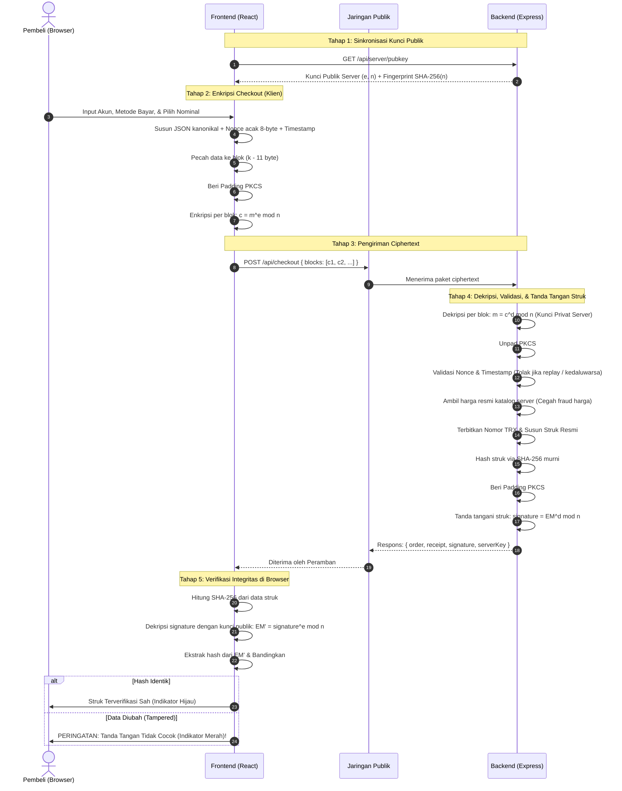

# Lapak Diamond — RSA Top-Up Hub

> **Tugas Besar Kriptografi — Kelompok 6**  
> Program Studi Teknologi Informasi / Teknik Informatika  
> Implementasi Mandiri Kriptografi RSA & SHA-256 (*Zero-Dependency*)

---

## 1. Identitas Kelompok

| Nama Lengkap | NRP | Fokus Pengerjaan |
| :--- | :---: | :--- |
| **Ahmad Rafi Fadhillah Dwiputra** | `5027241068` | Engine Kriptografi RSA, BigInt Math, Padding PKCS#1 v1.5, Key Generator |
| **Ananda Fitri Wibowo** | `5027241057` | Implementasi Mandiri SHA-256, Kanonikalisasi JSON, Integrasi Tanda Tangan Digital |
| **Naruna Vicranthyo Putra** | `5027241105` | Frontend Toko Top-Up, Resizable Crypto Dock, Verifikasi Struk & Anti-Tampering, Backend Express |

---

## 2. Gambaran Proyek

**Lapak Diamond** adalah platform toko top-up voucher game daring berbasis web yang dirancang untuk mendemonstrasikan penerapan nyata kriptografi kunci publik (**RSA**) secara menyeluruh:

1. **Kerahasiaan (*Confidentiality*)**: Melindungi kredensial sensitif pengguna (User ID, Zone ID, Nomor HP E-Wallet, dan PIN Transaksi) saat dikirim melalui jaringan menggunakan **Enkripsi RSA Klien**.
2. **Keaslian & Integritas (*Authenticity & Integrity*)**: Memastikan struk/bukti transaksi resmi diterbitkan oleh server dan belum pernah dimanipulasi menggunakan **Tanda Tangan Digital RSA (SHA-256)**.
3. **Ketahanan Replay (*Replay Protection*)**: Menolak paket transaksi terenkripsi yang dikirim ulang berulang kali oleh penyerang menggunakan mekanisme **Nonce & Timestamp Window**.
4. **100% Zero-Dependency**: Seluruh logika matematika modular, pembangkitan prima, padding PKCS#1 v1.5, dan fungsi hash SHA-256 dibangun sendiri dari nol menggunakan pustaka standar JavaScript (`BigInt`, `Uint8Array`, `crypto.getRandomValues`).

---

## 3. Arsitektur Sistem & Monorepo

Proyek ini menggunakan struktur monorepo terpadu:

```
c:/Kuliah/Sem5/Kripto/RSA/
├── packages/
│   ├── rsa/            # [ENGINE UTAMA] Matematika RSA murni, padding PKCS#1, SHA-256
│   └── shared/         # [SHARED] Validasi akun per game, format rupiah, masking privasi
├── server/             # [BACKEND] Express 5, REST API, penyimpanan kunci & order, audit log
├── client/             # [FRONTEND] React + Vite, Dark Store UI, Resizable Crypto Dock
└── scripts/            # Audit zero-dependency (check-rsa-deps.js) & reset data
```

### Diagram Alur Data Sistem



---

## 4. Alur Kerja RSA di dalam Sistem

Penerapan RSA di sistem Lapak Diamond terbagi ke dalam lima alur kerja utama:

### 4.1. Inisialisasi & Distribusi Kunci Server
1. Saat server dinyalakan pertama kali, server memuat atau membangkitkan pasangan kunci RSA (512-bit atau 1024-bit):
   - **Kunci Publik $(e, n)$**: Dibagikan kepada publik.
   - **Kunci Privat $(d, n)$**: Disimpan secara aman di server (`server/data/server-keys.json`).
2. Server menyediakan endpoint `GET /api/server/pubkey`.
3. Server menyertakan **Fingerprint Kunci**, yaitu 16 karakter heksadesimal pertama dari $\text{SHA-256}(n)$. Fingerprint ini ditampilkan di navbar klien sebagai sidik jari unik untuk memvalidasi bahwa klien terhubung ke server yang tepat.

---

### 4.2. Alur Enkripsi Transaksi di Klien (*Checkout Encryption*)

Enkripsi dilakukan langsung di peramban pembeli sebelum data meninggalkan perangkat:

```
[ Form Checkout ]
        │
        ▼
[ JSON Payload ] ──> Tambahkan Nonce (8-Byte acak) & Timestamp
        │
        ▼
[ UTF-8 Bytes ]  ──> Karena panjang data > kapasitas 1 blok modulus:
        │             Pecah menjadi potongan-potongan chunk (k - 11 byte)
        ▼
[ Padding PKCS#1 v1.5 Tipe 2 ] per Chunk:
  ┌──────┬──────┬────────────────────────────┬──────┬─────────────────┐
  │ 0x00 │ 0x02 │ PS (Byte Acak Non-Nol ≥8B) │ 0x00 │ Potongan Data M │
  └──────┴──────┴────────────────────────────┴──────┴─────────────────┘
        │
        ▼
[ Hitung: c = m^e mod n ] menggunakan Kunci Publik Server
        │
        ▼
[ Array Ciphertext Hex ] ──> POST /api/checkout
```

- **Peran Padding Acak (PS)**: Meskipun pengguna melakukan checkout dengan data akun dan nominal yang sama, padding string (PS) acak menjamin bahwa ciphertext heksadesimal yang dihasilkan **selalu berbeda setiap kali dikirim** (*probabilistic encryption*), sehingga penyerang tidak dapat menebak pola transaksi.

---

### 4.3. Alur Dekripsi & Proteksi Replay di Server

Ketika paket ciphertext tiba di backend server:

1. **Dekripsi RSA**:
   Server mendekripsi setiap blok ciphertext menggunakan kunci privat rahasianya:
   $$m = c^d \pmod n$$
2. **Pelepasan Padding & Rekonstruksi**:
   Server memverifikasi header `0x00 0x02`, menemukan separator `0x00`, mengambil payload data asli, menggabungkan seluruh chunk, lalu mem-parsing JSON transaksi.
3. **Verifikasi Anti-Replay (Nonce & Timestamp)**:
   - Server mengecek apakah selisih timestamp transaksi melampaui jendela toleransi ($\pm 60$ detik).
   - Server memeriksa token `nonce` di `nonceStore`. Jika nonce sudah pernah dicatat, transaksi langsung ditolak dengan kode respons `409 REPLAY_ATTACK`.
4. **Validasi Katalog Resmi**:
   Server mencocokkan item game yang dibeli dengan katalog internal server. Harga yang dibayar diambil dari basis data server untuk mencegah manipulasi harga dari sisi klien.
5. **Pencatatan Audit Aman**:
   Aktivitas transaksi dicatat di log server dengan nomor telepon yang disamarkan (`0812****7890`) dan PIN tidak pernah disimpan.

---

### 4.4. Alur Penandatanganan Digital Struk (*Digital Signature*)

Setelah transaksi sukses diproses, server membuat bukti pembayaran (struk) dan menandatanganinya secara kriptografis:

```
[ Data Struk Resmi ] (ID Transaksi, Game, Item, User ID, Waktu, Total Bayar)
        │
        ▼
[ Serialisasi Kanonikal ] (Atribut JSON diurutkan alfabetis agar deterministik)
        │
        ▼
[ Hashing SHA-256 ] ──> Menghasilkan Hash 32-Byte (256-bit)
        │
        ▼
[ Padding PKCS#1 v1.5 Tipe 1 ]:
  ┌──────┬──────┬────────────────────────────┬──────┬──────────────────┐
  │ 0x00 │ 0x01 │  PS (Deretan Byte 0xFF)    │ 0x00 │ Hash SHA-256 32B │
  └──────┴──────┴────────────────────────────┴──────┴──────────────────┘
        │
        ▼
[ Hitung: signature = EM^d mod n ] menggunakan Kunci Privat Server
        │
        ▼
[ Kirimkan Struk + Signature Hex ke Klien ]
```

Hanya pemegang kunci privat server yang dapat membuat tanda tangan digital yang sah untuk struk tersebut.

---

### 4.5. Alur Verifikasi Integritas Struk di Klien (*Signature Verification*)

Pada halaman bukti transaksi (`/receipt/:id`), peramban memverifikasi tanda tangan secara mandiri:

1. Peramban menghitung hash $\text{SHA-256}$ dari data struk kanonikal $\to \text{Hash}_{\text{dihitung}}$.
2. Peramban mendekripsi signature menggunakan kunci publik server:
   $$\text{EM}' = \text{signature}^e \pmod n$$
3. Peramban membaca format padding Tipe 1 dan mengekstrak 32 byte hash dari tanda tangan $\to \text{Hash}_{\text{signature}}$.
4. **Evaluasi Keabsahan**:
   - Jika $\text{Hash}_{\text{dihitung}} == \text{Hash}_{\text{signature}}$, struk **terbukti sah, asli, dan belum pernah dimanipulasi**.
   - Jika ada perbedaan satu bit saja pada data struk, kedua hash tidak akan cocok dan sistem memunculkan peringatan pemalsuan.

---

## 5. Fitur Utama Aplikasi

### 5.1. Validasi Akun Spesifik Game
- **Arena of Blades**: User ID wajib **6–10 digit angka**, Zone ID wajib **4–5 digit angka**.
- **Pixel Racers**: Racer ID wajib **8–12 digit angka** (tanpa Zone ID).
- **Sanitasi Dinamis**: Input huruf dan simbol langsung diblokir (*keystroke sanitization*), dilengkapi counter digit real-time (`length/max`), validasi saat *blur*, dan tombol *Beli Sekarang* hanya aktif bila seluruh input valid.
- **Form Pembayaran Bersih**: Input nomor HP dan PIN kosong secara default dengan placeholder contoh informatif dan toggle intip PIN.

### 5.2. Panel DevTools Kripto yang Dapat Diperbesar (*Resizable Crypto Dock*)
Panel di bagian bawah layar dirancang sebagai laboratorium visualisasi proses kriptografi:
- **Tarik untuk Memperbesar (*Drag-to-Resize*)**: Pegangan drag di tepi atas memungkinkan panel ditarik dari ukuran standar 340px hingga maksimal 850px. Mendukung **klik 2x** atau tombol *Perbesar/Standar*.
- **Tab Paket Jaringan**:
  - *Summary Bar*: Modulus bit, Fingerprint kunci, ukuran payload, jumlah blok, dan durasi enkripsi browser.
  - *Visualizer Padding EM Interaktif*: Menampilkan bar proporsional per blok yang dipilih (`[Blok 1]`, `[Blok 2]`, dst.) dengan rincian segmen byte asli (`00 02`, `PS Acak`, `00`, `Data M`).
  - *Plaintext vs Ciphertext*: JSON terformat rapi berdampingan dengan daftar blok hex (lengkap dengan tombol salin dan demo uji replay attack).
- **Tab Log Server & Kripto**: Terminal log dengan filter sumber (`Semua`, `Server`, `Klien`) dan tombol ekspansi metadata JSON `[+] Detail`.
- **Tab Kunci Aktif**: Menampilkan modulus publik $n$, eksponen $e$, dan penjelasan sidik jari kunci.

### 5.3. Simulasi Pemalsuan Struk (*Live Tampering Test*)
Di halaman struk pembayaran, pengguna dapat mengaktifkan toggle *Simulasi Pemalsuan Data* untuk mengubah User ID atau nominal pembayaran secara langsung. Sistem akan langsung memperlihatkan verifikasi tanda tangan digital gagal (berubah merah) karena nilai hash berubah.

### 5.4. Playground RSA & Key Generator
- **Key Generator (`/keys`)**: Membangkitkan kunci 512/1024-bit secara bertahap atau mode edukasi numerik kecil ($p=61, q=53$).
- **Playground (`/playground`)**: Laboratorium eksperimen enkripsi/dekripsi mandiri (Textbook vs Padding) serta pengujian tanda tangan digital langsung.

---

## 6. Panduan Menjalankan Aplikasi

### Persyaratan Sistem
- **Node.js**: Versi $\ge 20.0.0$ (Direkomendasikan Node.js v24).
- **NPM**: Versi $\ge 10.0.0$.
- **Peramban Web**: Chrome, Edge, Firefox, atau Safari.

### 1. Instalasi Dependensi
Jalankan di root repositori:
```bash
npm install
```

### 2. Menjalankan Mode Pengembangan (Frontend + Backend)
Menjalankan backend Express (port 3000) dan dev server Vite (port 5173) secara bersamaan:
```bash
npm run dev
```
Buka peramban di: **`http://localhost:5173`**

### 3. Menjalankan Mode Produksi (Single Port)
Membangun bundel frontend dan menjalankannya melalui server Express:
```bash
npm run build
npm start
```
Buka peramban di: **`http://localhost:3000`**

### 4. Reset Data Transaksi Demo
Mengembalikan basis data transaksi JSON dan kunci server ke kondisi awal:
```bash
npm run reset-data
```

---

## 7. Pengujian Otomatis & Verifikasi Zero-Dependency

### Menjalankan Test Suite (Vitest)
```bash
npm test
```
Menjalankan **17 test suites (84 test cases)** meliputi:
- Uji roundtrip 500 pesan acak multi-blok RSA.
- Uji primalitas Miller-Rabin & penolakan bilangan Carmichael ($561, 1105$).
- Uji vektor resmi NIST SHA-256.
- Uji integrasi Express Supertest (checkout, anti-replay nonce, batas min/max per game).
- Uji privasi log (penyamaran nomor HP dan PIN).

### Memeriksa Aturan Bebas Dependensi (*Zero-Dependency Check*)
Memastikan modul inti `@topup/rsa` murni 100% tanpa modul luar:
```bash
npm run check:deps
```
Output yang diharapkan:
```
Memeriksa dependensi package.json...
Memindai berkas di packages/rsa/src/...
SUKSES: Modul @topup/rsa murni 100% tanpa dependensi eksternal.
```

---

*Hak Cipta © 2026 Kelompok 6 Kriptografi. Dibuat untuk tujuan akademik dan edukasi keamanan sistem informasi.*
